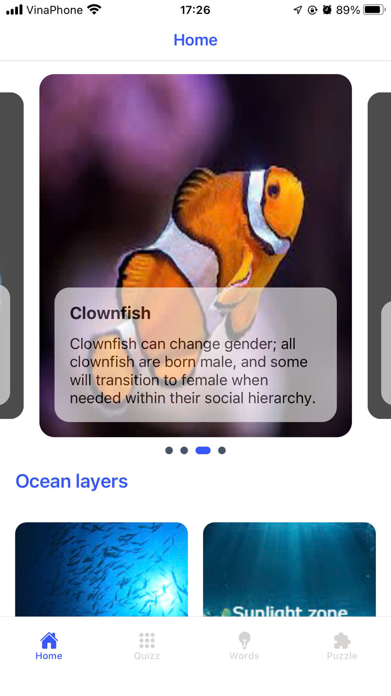
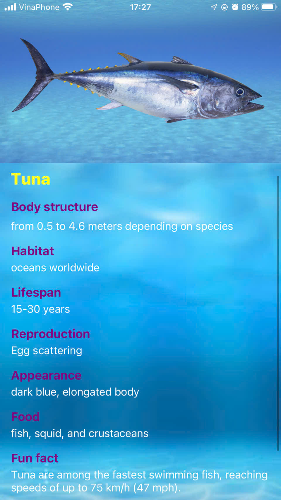
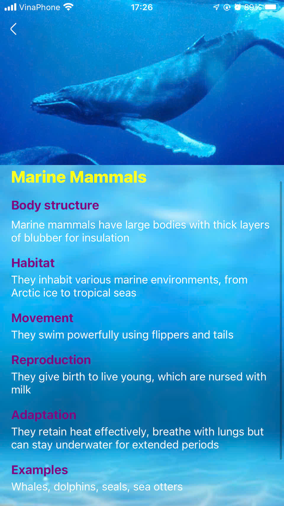
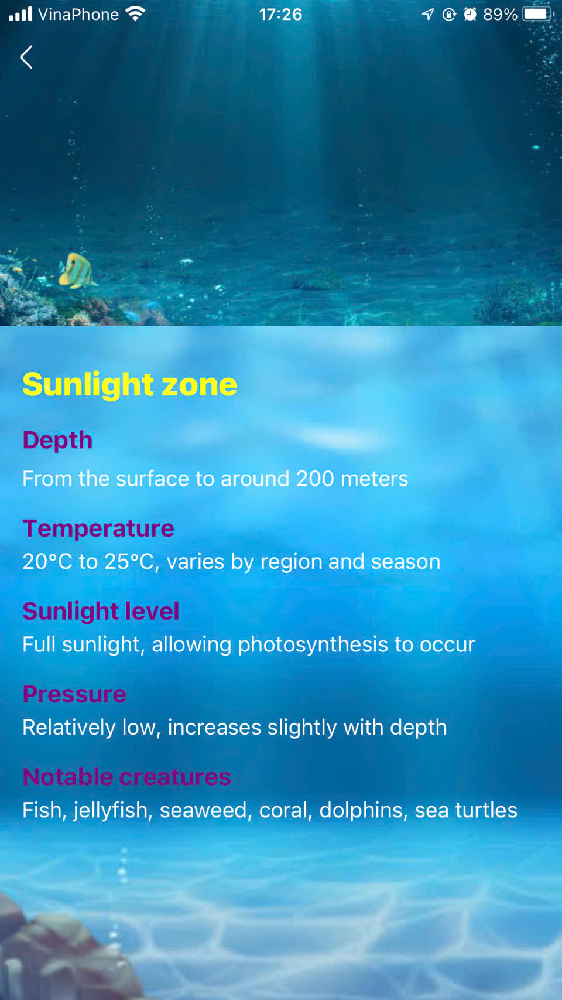
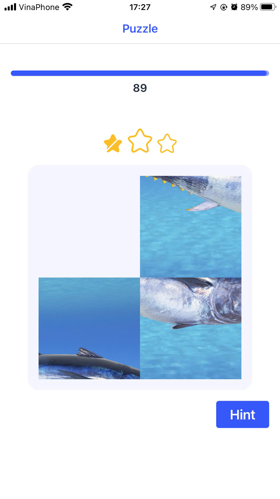
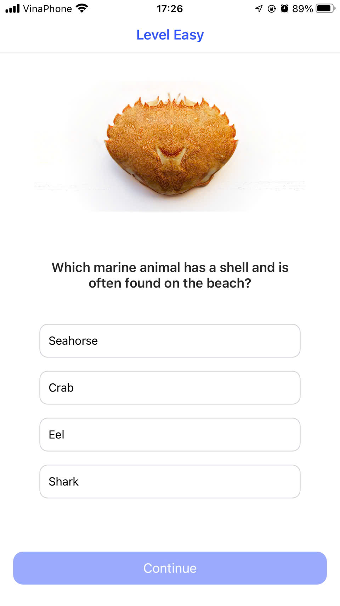

# Sea Sense

## Demo App
https://drive.google.com/file/d/1f17GEGrYuwJGY7pzbIa_EP8I65x9jotx/view?usp=drive_link
## Table of Contents
  - [About](#about)
  - [Features](#features)
  - [Screenshots](#screenshots)
  - [Getting Started](#getting-started)
    - [Prerequisites](#prerequisites)
    - [Installation](#installation)

## About
 Sea Sense aims to educate and provide information about the ocean and creatures within for people of all ages through interactive games and quizzes. 


## Features
The app includes features such as information pages, quizzes, engaging games, and tasks that encourage curiosity about the ocean. It also highlights interesting facts about sea creatures. 

## Screenshots
<!-- Screenshot image of some screen and place in ~/images folder from root app -->








## Getting Started

### Prerequisites

- Node.Js: https://nodejs.org/en
- Expo: https://docs.expo.dev/get-started/installation/
- Yarn: https://classic.yarnpkg.com/lang/en/docs/install/#mac-stable

### Installation

- Clone the repository to your local machine
- Install dependencies using npm or yarn
- Run the app using `yarn start` or another suitable command

```bash
git clone https://github.com/Phuc1Le/Sea-Sense
cd app-marine
yarn
yarn start
